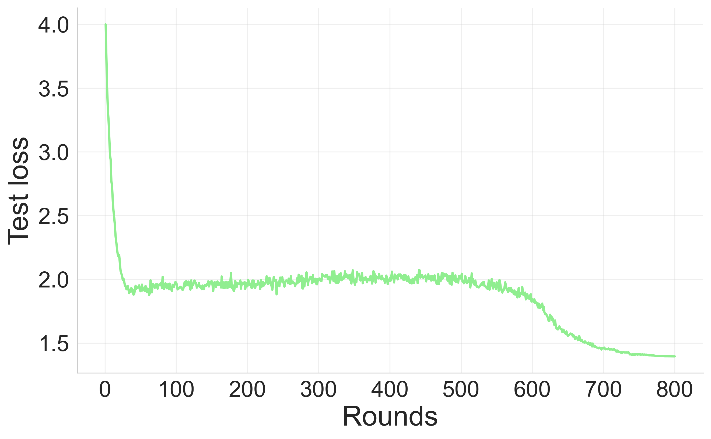

## Overfitting

In this document, we present the loss functions of both our method and the baseline semiFL. For both approaches, we display the training and test loss curves. It's evident that after 800 rounds of communication, semiFL begins to exhibit signs of overfitting, as indicated by its increasing test loss curve. In contrast, our method demonstrates no evidence of overfitting. Furthermore, our method achieves a higher training accuracy compared to semiFL.

Additionally, we present the validation loss for our method. To accomplish this, we utilize a portion of the client data as a validation set. The validation process entails computing the cross-entropy loss on classifications within the space where the client data possess true labels. This validation loss serves as a valuable metric for identifying any indications of overfitting and determining when to cease training. It's essential to emphasize that such validation is impractical for semiFL since it lacks client supervision information.

### Ours (train, test, validation loss, and test accuracy)

  
  

### SemiFL(train, test loss, and test accuracy)

  
 

